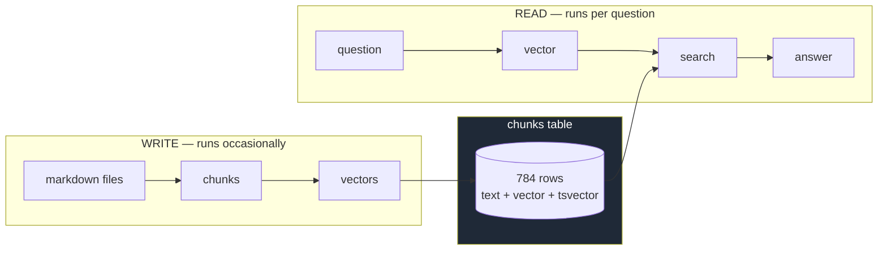
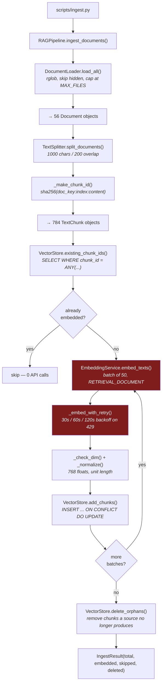
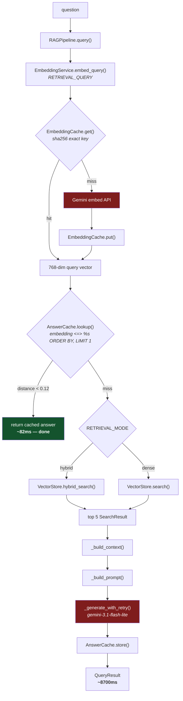
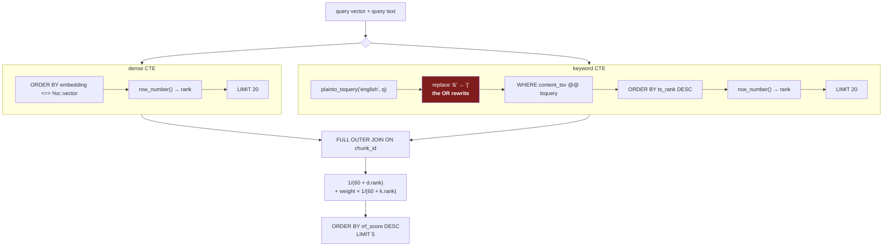

# Architecture flow

The two paths through the system, end to end, with the method that runs at each
step. Diagrams render on GitHub.

Companion documents:
- [`code-walkthrough.md`](code-walkthrough.md) — what each method actually does
- [`testing.md`](testing.md) — how it was tested and measured

---

## The two paths

A RAG system has exactly two flows, and they meet in one table.



**Write** is expensive and rare: 784 embedding API calls, minutes of wall clock.
**Read** is cheap and constant: one embedding call, one SQL query, one generation
call.

Everything below expands those two boxes.

---

## Models and strategies

The decisions, in one table, before the flow that uses them.

| Concern | Choice | Why |
|---|---|---|
| **Embedding model** | `gemini-embedding-001` | Free tier, 3072 native dimensions |
| **Embedding size** | **768**, Matryoshka-truncated + renormalized | pgvector's HNSW caps at 2000 dims. 768 is a size the model supports natively |
| **Generation model** | `gemini-3.1-flash-lite` | Cheap, fast, sufficient for extractive answering |
| **Vector store** | **Postgres 16 + pgvector** | Vector *and* full-text in the same row — hybrid is one SQL query |
| **Chunking** | Recursive character, 1000 chars / 200 overlap | Structure-agnostic baseline; alternatives listed but unmeasured |
| **Chunk identity** | `sha256(doc_key : chunk_index : content)[:16]` | Content-addressed — makes incremental ingest possible at all |
| **Dense retrieval** | Cosine distance, `<=>` operator | Scale-invariant, standard for normalized text embeddings |
| **Keyword retrieval** | Postgres `tsvector` + GIN, OR-rewritten query | Catches exact identifiers that dense search compresses away |
| **Fusion** | **Reciprocal Rank Fusion**, `k=60`, keyword weight 1.0 | Combines by *rank*, not score — no normalization needed |
| **Task types** | `RETRIEVAL_DOCUMENT` for chunks, `RETRIEVAL_QUERY` for questions | Same text under each produces different vectors, by design |
| **Query cache** | Exact SHA-256 of `model:dims:task_type:text` | Deterministic, cheap |
| **Answer cache** | **Semantic** — cosine distance < 0.12 | Calibrated from measured data, not guessed |

### Why 768 and not 3072

The model returns 3072 dimensions. pgvector's HNSW index refuses anything over
2000, so 3072 would leave the table permanently unindexable. 768 is a size
`gemini-embedding-001` supports directly through **Matryoshka representation
learning** — the leading dimensions are trained to work as a complete embedding
on their own, so truncating is not the same as throwing away information.

Truncation leaves the vector no longer unit-length, so `_normalize()` rescales
it. Cosine distance would not care; L2 and inner product would.

### Why RRF and not score addition

Dense search produces a bounded cosine distance (0 to 2). Keyword search
produces an unbounded `ts_rank` relevance. Adding them is meaningless — the
scales have no relationship.

RRF throws both scores away and combines **positions**:

```
score(chunk) = 1/(60 + dense_rank) + weight × 1/(60 + keyword_rank)
```

A chunk ranked 1st in a list contributes 1/61. Ranked 2nd, 1/62. **Appearing in
both lists beats ranking high in one**, which is exactly the behaviour wanted.
No normalization, no per-corpus tuning, nothing to re-tune as data drifts.

---

## Flow 1 — Ingestion

From markdown files on disk to vectors in Postgres.



Red boxes are the only steps that cost money or hit a network.

### The three properties worth naming in an interview

**1. It is a sync, not a rebuild.** Re-running over an unchanged corpus costs
**zero API calls** and about five seconds. The diff at `existing_chunk_ids()`
matches on `chunk_id` **and** `embedding_model` **and** `embedding_dim` — vectors
from different models occupy different spaces, so reusing across a model change
would corrupt the index silently.

**2. Each batch is written before the next is embedded.** Not "embed everything,
then store everything". The free tier is 100 texts per minute, so a full corpus
takes tens of minutes and *will* hit 429s — that is the normal path, not an
anomaly. Persisting per batch means a failure forty minutes in costs one batch,
and re-running resumes because every stored chunk is skipped by the diff.

That happened during the real ingest, and cost nine chunks out of 778.

**3. Chunk IDs are content-derived.** This is the decision the rest depends on.

```python
chunk_id = sha256(f"{doc_key}:{chunk_index}:{content}").hexdigest()[:16]
```

It used to be a global counter across the corpus. Adding one document renumbered
every chunk after it, and `add_chunks`'s upsert silently overwrote unrelated
documents' rows. No error — answers just started coming from the wrong pages.

Content-addressing makes *"have I already embedded this?"* a primary-key lookup
instead of a bookkeeping problem. Incremental ingest, resumable runs, and orphan
cleanup are all downstream of it. Under the positional scheme, none could exist.

---

## Flow 2 — Query

From a question to an answer, with both caches in the path.



### Why the question is always embedded, even on a cache hit

Because the embedding **is what the cache searches with**. You cannot look up a
semantic cache without a vector. It is also the cheap step — roughly 1% of the
cost of the retrieval and generation it can avoid.

Measured: **8700 ms → 82 ms** on a cache hit.

### The two caches are not the same mechanism

| | `embedding_cache` | `answer_cache` |
|---|---|---|
| Lookup | **exact hash** — `WHERE cache_key = ...` | **nearest vector** — `ORDER BY embedding <=> ...` |
| `"what is a pod?"` vs `"what is a pod???"` | different key → **miss** | 0.0173 apart → **hit** |
| Stores | 768 floats | the generated answer text |
| Saves | the embedding call (~1%) | retrieval **and** generation (~99%) |

The threshold was calibrated, not guessed:

```
rephrasings of the same question    0.0093, 0.0529, 0.0704
closest two DIFFERENT questions     0.2110
                                    ─────────
threshold                           0.12   ← sits in the gap
```

Answers are keyed by `corpus_version` too, so re-ingesting invalidates every
cached answer rather than serving conclusions drawn from an old index.

---

## Flow 3 — Inside hybrid search

The single SQL statement in `VectorStore.hybrid_search()`, which is where the
project's headline result comes from.



**`FULL OUTER JOIN`** is deliberate. A chunk found by only one arm must still
compete — `COALESCE(..., 0)` gives it zero from the arm that missed it. An inner
join would return only chunks both arms found, which is the opposite of what
fusion is for.

**Both arms retrieve 20, not 5.** Fusion needs material: a chunk ranked 12th by
vector and 3rd by keyword should be able to surface into the final top 5. If both
arms only returned 5, fusion could only reorder what dense already had.

### The OR rewrite — the bug that made hybrid do nothing

`plainto_tsquery` joins every term with **AND**:

```sql
plainto_tsquery('english', 'how are secrets mounted into pods')
→ 'secret' & 'mount' & 'pod'
```

A fifteen-word question therefore requires one chunk containing **all fifteen
stems**. Across 784 chunks that matched **zero rows** — so the keyword CTE was
always empty, the full outer join degenerated to the dense side, and hybrid
returned byte-identical results to dense.

The fix rewrites the operators:

```sql
replace(plainto_tsquery('english', %(q)s)::text, '&', '|')::tsquery
→ 'secret' | 'mount' | 'pod'
```

**0 matches → 416 matches.** `ts_rank` then scores chunks higher for matching
more terms, weighted by term rarity — which is search semantics rather than
filter semantics.

The unit tests missed this because they used **one-word queries**, where AND and
OR are identical. `test_hybrid_keyword_arm_works_on_a_realistic_question` exists
to close that gap.

---

## The result this produces

43 hand-verified questions, 784 chunks:

| Mode | recall@1 | recall@5 | recall@10 | MRR |
|---|---:|---:|---:|---:|
| Dense (vector only) | 0.67 | 0.95 | 0.98 | 0.80 |
| **Hybrid (vector + keyword + RRF)** | **0.74** | **0.98** | 0.98 | **0.83** |

Broken down by question style, which is where the story is:

| Style | recall@1 | recall@5 |
|---|---|---|
| `exact_term` — names identifiers like `UnknownVersionInteroperabilityProxy` | 0.71 → **0.86** | 0.95 → **1.00** |
| `paraphrase` — natural phrasing, no identifier | 0.64 → 0.64 | 0.95 → 0.95 |

**The entire gain is on identifier questions, and paraphrased ones are
untouched.** That is exactly the textbook prediction: the keyword arm can only
help when the question and the answer share vocabulary. Being able to show *where*
the gain landed, not just that a number moved, is the difference between "I added
hybrid search" and understanding what it does.

---

## Where to look in the code

| Flow step | File | Method |
|---|---|---|
| Load | [`document_loader.py`](../../src/rag/document_loader.py) | `load_all()` |
| Split + chunk ID | [`text_splitter.py`](../../src/rag/text_splitter.py) | `split_documents()`, `_make_chunk_id()` |
| Diff | [`vector_store.py`](../../src/rag/vector_store.py) | `existing_chunk_ids()` |
| Embed | [`embeddings.py`](../../src/rag/embeddings.py) | `embed_texts()`, `embed_query()` |
| Store | [`vector_store.py`](../../src/rag/vector_store.py) | `add_chunks()`, `delete_orphans()` |
| Dense search | [`vector_store.py`](../../src/rag/vector_store.py) | `search()` |
| Hybrid search | [`vector_store.py`](../../src/rag/vector_store.py) | `hybrid_search()` |
| Orchestration | [`pipeline.py`](../../src/rag/pipeline.py) | `ingest_documents()`, `query()` |
| Caches | [`embedding_cache.py`](../../src/rag/embedding_cache.py), [`answer_cache.py`](../../src/rag/answer_cache.py) | `get()`/`put()`, `lookup()`/`store()` |
| Schema | [`schema.sql`](../../src/rag/schema.sql) | three tables, two indexes |
